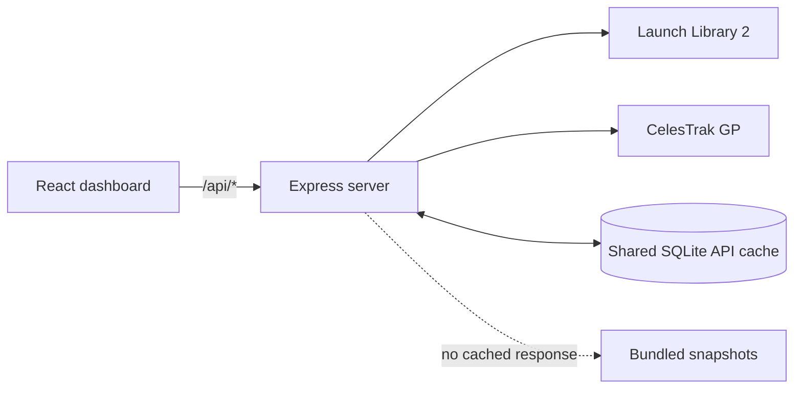

# Architecture

## Overview

SpaceX Mission Data is a small full-stack TypeScript application. The browser
talks only to the local Express API; the server owns upstream access,
validation, normalization, caching, and fallback decisions.

## Runtime components

### Client

- `src/MissionApp.tsx` composes mission, event, Starlink, and detail views.
- `src/api.ts` is the typed boundary for the local HTTP API.
- `src/types.ts` defines normalized response contracts used by the UI.
- TanStack Query handles request state, client freshness, retries, and section
  isolation.
- `src/styles.css` contains the responsive visual system.

The client does not interpret raw LL2 or CelesTrak records. It renders stable,
UI-oriented contracts returned by the server.

Mission and event filtering is client-side because the dashboard already
retrieves intentionally bounded result sets. Search matches normalized names,
descriptions, locations, status, orbit, and vehicle fields without issuing
additional rate-limited upstream requests.

The data-status section reads `/api/cache`, which exposes only row timestamps,
payload sizes, freshness, and aggregate detail counts. Cached payloads and the
local database path are never sent to the browser.

### Server

- `server/app.ts` wires Express routes and service orchestration.
- `server/upstream.ts` performs timeout-aware HTTP requests, validates response
  shapes, and provides a short in-memory cache.
- `server/schemas.ts` defines Zod contracts for external payloads.
- `server/normalize.ts` maps external records into frontend contracts and
  derives orbital metrics.
- `server/disk-cache.ts` stores validated LL2 and CelesTrak payloads in SQLite.
- `server/starlink.ts` enforces the CelesTrak two-hour refresh policy.
- `server/ll2-bootstrap.ts` and `server/bootstrap.ts` contain bounded fallback
  snapshots used only when no successful disk record exists.

## Request flows

### Launches, events, and mission details

1. The route checks `.cache/mission-data.sqlite`.
2. A row younger than ten minutes is returned without an upstream request.
3. An absent or expired row triggers an LL2 request.
4. The response is validated with Zod before it is persisted.
5. Successful data replaces the corresponding SQLite row.
6. If the refresh fails, an expired valid row is returned as stale.
7. For launch and event lists only, a bounded bundled snapshot is used when no
   disk row exists.

SQLite keys are separated by resource:

- `ll2:launches`
- `ll2:events`
- `ll2:launch:<uuid>`

### Starlink elements

1. The service reads the `celestrak:starlink` row from
   `.cache/mission-data.sqlite`.
2. Data younger than two hours is summarized immediately.
3. Expired or absent data triggers one CelesTrak group download.
4. Successful records are validated, persisted with an atomic SQLite upsert,
   and summarized.
5. A failed refresh returns stale disk data or the labeled bootstrap sample.
6. An in-process backoff prevents repeated downloads during the cooldown.

Orbital altitude is derived from mean motion using the Earth gravitational
parameter and radius. The plot is a sampled RAAN-versus-inclination view, not a
live telemetry view. The ground-position map advances mean anomaly from each
element epoch and rotates the resulting orbital-plane vector by Greenwich
sidereal time. This lightweight two-body projection is intentionally labeled
approximate; it is not an SGP4 ephemeris or a live spacecraft position.

## Data boundaries

Upstream JSON is untrusted. Zod schemas reject malformed payloads before they
reach normalization or persistent storage. Browser-facing types deliberately
contain only fields needed by the interface.

Launch detail identifiers are validated as UUIDs before being interpolated into
an upstream URL. The server uses Helmet, disables the Express signature, and
does not expose secrets to the client.

## Failure model

Launches, events, and orbital data use independent queries, so one unavailable
provider does not blank the entire dashboard. Responses distinguish:

- **Current**: within the source freshness window.
- **Stale**: the last successful disk record served after a failed refresh.
- **Sampled**: a small bundled fallback, explicitly not a complete dataset.

Mission drawers always retain compact data from the selected card. If rich
detail enrichment fails, the known mission summary remains visible with a
retry action.

## Build and deployment

Development runs Vite and Express as separate processes. Production builds:

- Browser assets into `dist/`.
- Server JavaScript into `dist-server/`.

The production Express process serves both `/api` routes and the Vite static
assets on port `8787`. Cache files are runtime state and must not be included in
artifacts or commits.

## Testing

- `server/app.test.ts` covers route normalization, malformed upstream data,
  persistent cache recovery, CelesTrak caching, and cooldown behavior.
- `src/MissionApp.test.tsx` covers primary rendering, independent failures,
  fallback labeling, action visibility, and the mission detail drawer.
- `src/utils.test.ts` covers formatting and calculation helpers.

Changes should pass `npm test`, `npm run typecheck`, `npm run lint`, and
`npm run build`.
